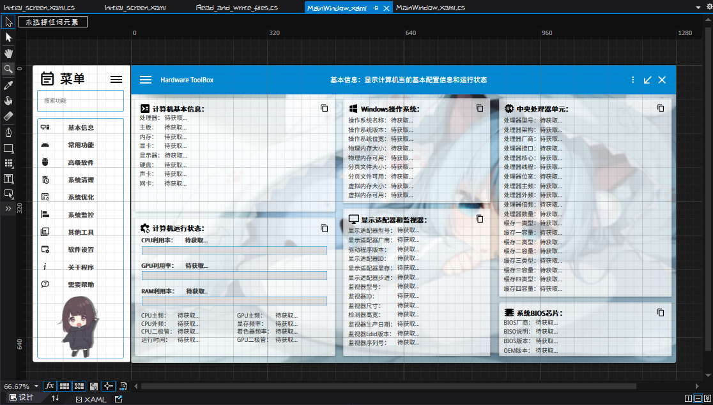
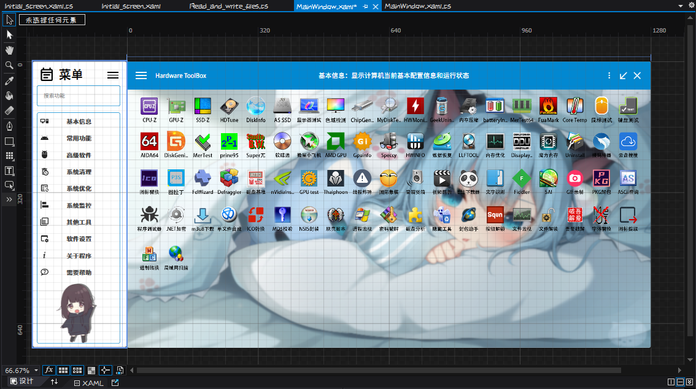
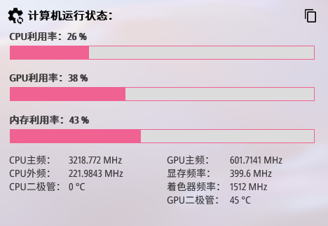
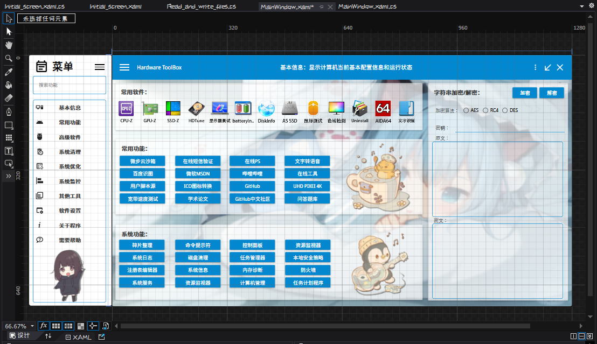

##### Hardware_ToolBox

#### 卡片式布局电脑硬件工具箱

程序采用卡片式布局

提供了检测电脑硬件的详细详细

支持动态监测系统各项详细，如占用率，硬件频率

增加常用软件，如CPU-Z，GPU-Z，ADID64等工具

项目还在开发状态，目前还没有完工

## 下面是界面预览图↓↓↓

## 请注意：

目前软件并没有完工，大概完成了5/2的样子...

目前测试版本链接：

网盘：链接: https://pan.baidu.com/s/1bPkZM_dYEQoeNoVKRSrrZA 提取码: j2jp 

现在项目暂时属于”咕咕咕“的状态，暂时不想写下去了[哭笑](实际上是懒得写emmmmm...)

其中打开软件的快捷方式由于整个文件夹太大，无法放入库中 ，所以提供了文件夹的下载链接

网盘：链接: https://pan.baidu.com/s/1gW5vG6hgV_X_BTpqEcOAFA 提取码: md8u

使用方法：文件解压后，将名称为“Software catalog”的文件夹放置到Debug目录下，然后启动程序即可

