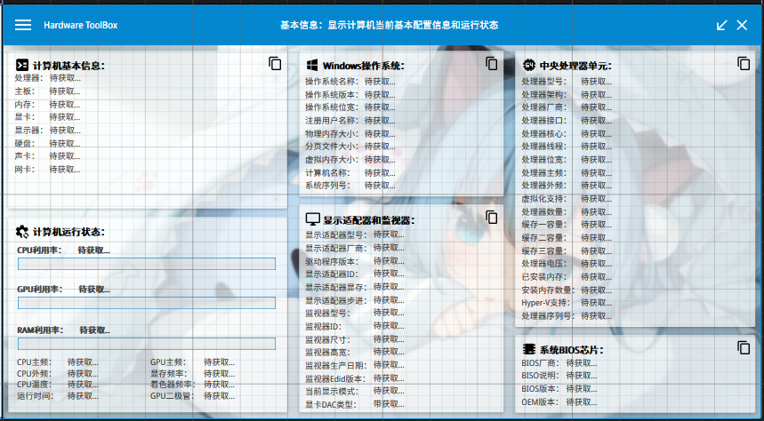
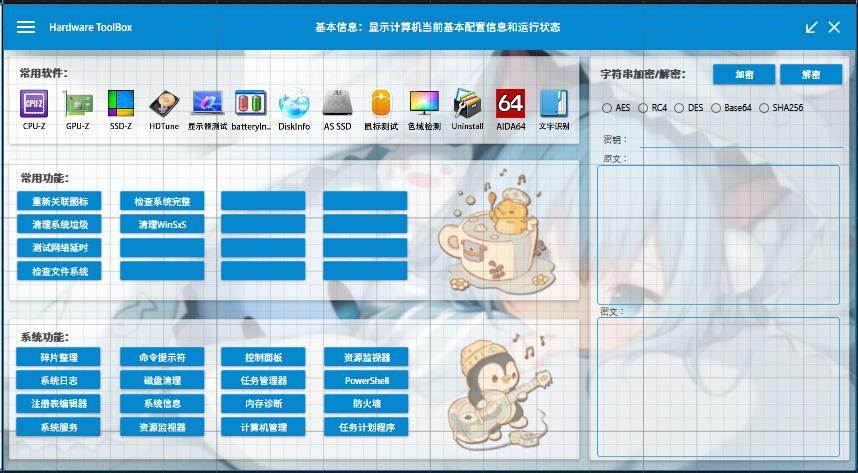
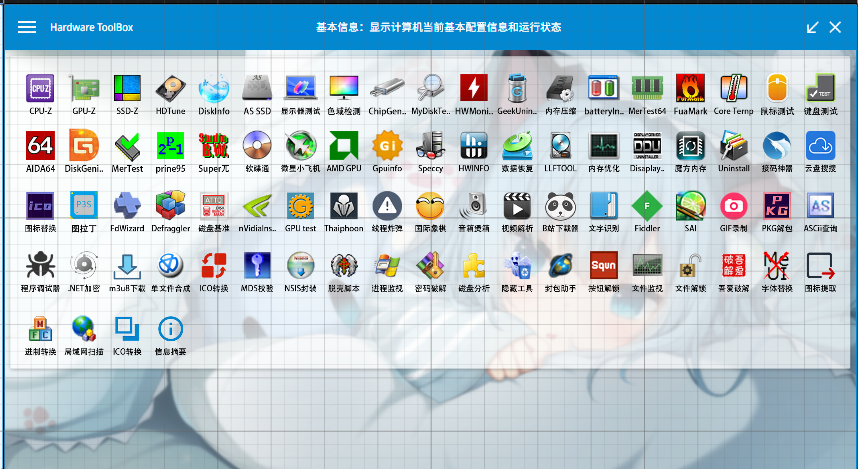
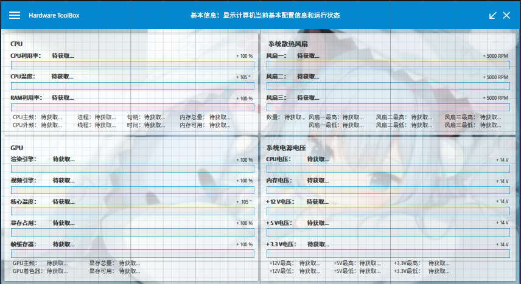
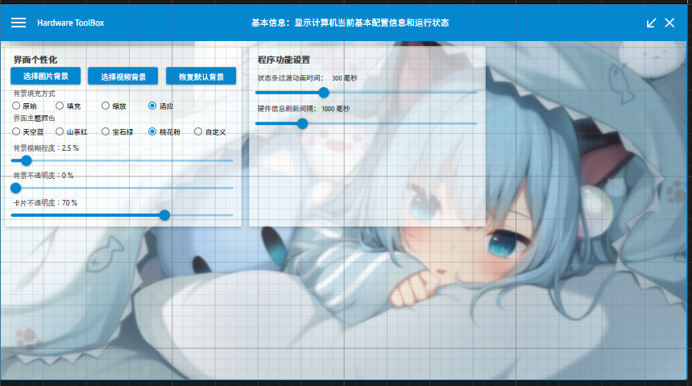
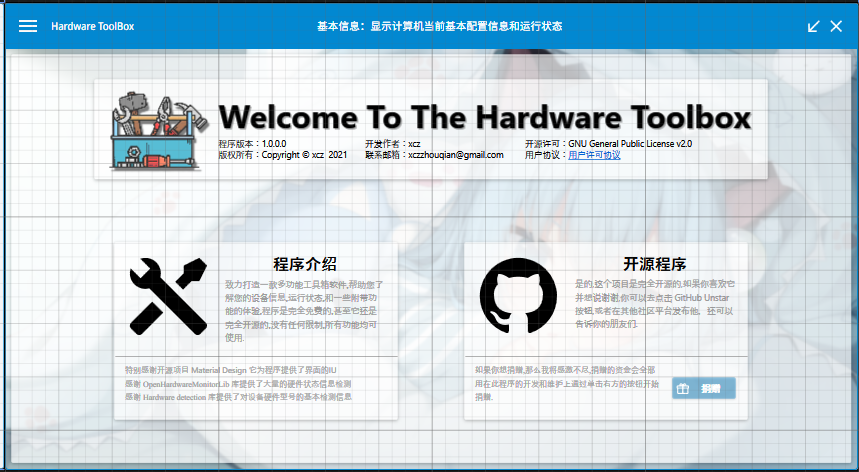

## 项目介绍

程序使用 C# 语言，基于.NET 4.7.2 控件来开发

总体使用卡片式布局，抽屉式菜单，丰富过渡动画

## 他能干什么？

1.它可以对你的电脑生产一份比较详细的详细报告

2.它提供了一些知名软件(CUP-Z，GPU-Z...)的快捷打开方式

3.它提供了一些系统自带选项的快捷打开方式

4.它可以监控您的电脑信息，如频率，电压，温度，状态和风扇转速等众多信息显示

5.提供一些其他程序自带软件，如编码转换,文件解锁等功能

## 我该如何得到它？

你可以直接克隆源码到本地进行编译程序

你还可以使用我提供的下载链接进行下载安装程序

## 它长什么样子？

以下图片仅供参考，不代表最终界面设计

## 注意！！！

目前软件并没有完工，大概完成了2/5的样子...

目前测试版本链接：

网盘：链接: https://pan.baidu.com/s/1bPkZM_dYEQoeNoVKRSrrZA 提取码: j2jp 

现在项目暂时属于”咕咕咕“的状态，暂时不想写下去了(实际上是懒得写emmmmm...)

其中打开软件的快捷方式由于整个文件夹太大，无法放入库中 ，所以提供了文件夹的下载链接

网盘：链接: https://pan.baidu.com/s/1gW5vG6hgV_X_BTpqEcOAFA 提取码: md8u

使用方法：文件解压后，将名称为“Software catalog”的文件夹放置到Debug目录下，然后启动程序即可

